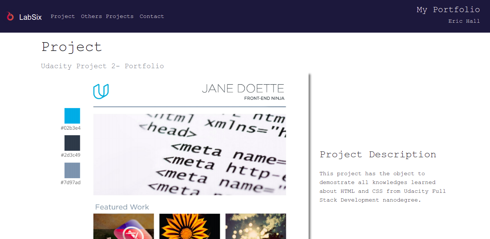

# Project 2 - Full Stack Web Developer Nanodregree

This project is part of the nanodegree Web Full Stack Developer from Udacity. It implements my portpolio web page using the basic from html, css and javascript. The web page has responsive feature.



## Features

- Resposive web page using bootstrap CSS Framework.

## Getting Started

These instructions will get you a copy of the project up and running on your local machine for development and testing purposes. See deployment for notes on how to deploy the project on a live system.

### Prerequisites

```
1- A good browser.
```
## Steps

* All you have to do it is open the file "index.html" in your favorite browser.

## How to Contribute

If would like to contribuite with this code, please fork this repository using the command below:

```
https://github.com/ericmbf/fullStackWebDeveloperProject2.git
```

## License

The contents of this repository are covered under the [MIT License](LICENSE).

